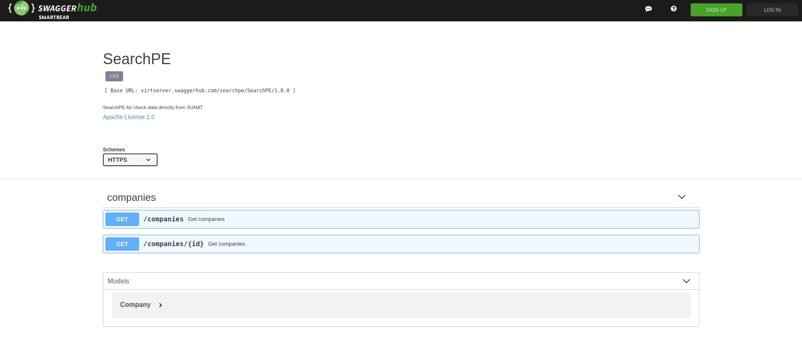

# Sunat API
Aplicacion que propociona consulta ruc.

https://searchpe.gitbook.io/searchpe/

# Restful API (https://app.swaggerhub.com/apis-docs/searchpe/searchpe)
SearchPE utiliza Swagger para la documentación de sus servicios web.

